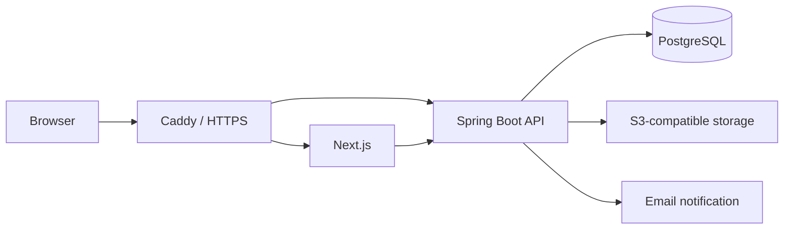

# Denho Photo Company

[日本語](README.md) | [English](README.en.md)

A commissioned multilingual corporate website and content management system for Denho Photo Company (田豊株式会社, pronounced *Denho* / でんほう).

The public website presents the company's services, photography work, articles, company information, and contact channel in Japanese, Simplified Chinese, and English. An internal administration system enables staff to manage content, media, notices, and inquiries in one place.

> **Project status: Pre-launch**
>
> The main design and implementation work is complete. Final adjustments are now in progress to incorporate the approved photography and copy before production deployment.

## Background

This is a commercial web application designed for continued use in a real business. It goes beyond a static corporate website by providing an operational foundation that allows authorized staff to update information safely after launch.

My work covers requirements clarification, information architecture, frontend and API development, database design, authentication, testing, and containerized deployment architecture.

## Key Features

### Public Website

- Japanese, Simplified Chinese, and English content
- Services, photography work, articles, and company information
- Locale-aware routing designed with multilingual SEO in mind
- Responsive layouts
- Contact inquiry form
- Time-limited site notices

### Content Administration

- Role-based access for administrators and editors
- Article, photography work, and notice management
- Draft, publish, and archive workflows
- Content revision history and audit events
- Media management backed by S3-compatible object storage
- Inquiry review and status management

### Security and Operations

- Argon2id password hashing
- Passwords of at least 8 characters with temporary lockout after repeated failures
- Server-side sessions and authorization checks
- Form protection with origin validation, a honeypot field, and rate limiting
- Security headers including Content Security Policy
- Database migrations with Flyway
- Encrypted backup and restore-verification tooling

## Architecture



- Next.js serves the public website and administration interface.
- The Spring Boot API manages authentication, content, media, and inquiries.
- PostgreSQL stores content, sessions, revision history, and audit data.
- TypeScript API types are generated from the OpenAPI contract to keep the frontend and backend aligned.
- Caddy provides HTTPS termination and reverse proxying in the production container architecture.

## Technology

| Area | Technology |
| --- | --- |
| Frontend | Next.js 16, React 19, TypeScript, Tailwind CSS 4 |
| Forms | React Hook Form, Zod |
| Backend | Java 25, Spring Boot 4.1, Spring Security, Spring Data JPA |
| Database | PostgreSQL, Flyway, JDBC Session |
| Storage / Email | S3-compatible Object Storage, Amazon SES |
| API Contract | OpenAPI 3, openapi-fetch |
| Testing | Vitest, Testing Library, Playwright, JUnit, Testcontainers |
| Infrastructure | Docker Compose, Caddy |

## Project Structure

```text
apps/
├── web/        # Public website and administration interface
└── api/        # Spring Boot API
infra/          # Local services, production containers, and backup tooling
```

## Local Development

### Requirements

- Node.js 24 LTS
- npm
- Java 25
- Docker

### Setup

Install the dependencies:

```bash
npm ci --ignore-scripts
```

Create `infra/.env`, `apps/web/.env.local`, and `apps/api/.env` from their matching example files. Keep the database and object-storage connection values consistent between `infra/.env` and `apps/api/.env`.

Then start PostgreSQL, the local object storage service, and the development mail viewer:

```bash
docker compose --env-file infra/.env -f infra/compose.yml up -d
```

Start the API in a separate terminal. Spring Boot does not load `apps/api/.env` automatically, so import it into the process environment first.

macOS / Linux:

```bash
set -a
. apps/api/.env
set +a
cd apps/api
./gradlew bootRun
```

Windows PowerShell:

```powershell
Get-Content .\apps\api\.env | Where-Object { $_ -match '^\s*[^#][^=]*=' } | ForEach-Object {
  $name, $value = $_ -split '=', 2
  Set-Item -Path "Env:$($name.Trim())" -Value $value.Trim()
}
.\apps\api\gradlew.bat -p .\apps\api bootRun
```

Start the web application in a third terminal. `npm run dev` starts only the web application, so the local services and API must already be running.

```bash
npm run dev
```

The development server is available at `http://localhost:3000`.

## Verification

Frontend:

```bash
npm run test:unit
npm run lint
npx tsc --noEmit -p apps/web/tsconfig.json
npm run build
```

Backend:

```bash
cd apps/api
./gradlew build
```

With the local services running, the browser E2E suite can also be executed:

```bash
npm run test:e2e --workspace @tianho/web
```

## Public Repository Notice

This repository is public for portfolio presentation and code review. It does not contain production credentials, customer data, or private operational procedures.

Production photography, copy, trademarks, and other materials supplied by Denho Photo Company or third parties remain the property of their respective rights holders.

## License

The source code is visible for review but is not open source. Unauthorized use, copying, modification, redistribution, sale, or deployment is prohibited. See [LICENSE](LICENSE) for details.
