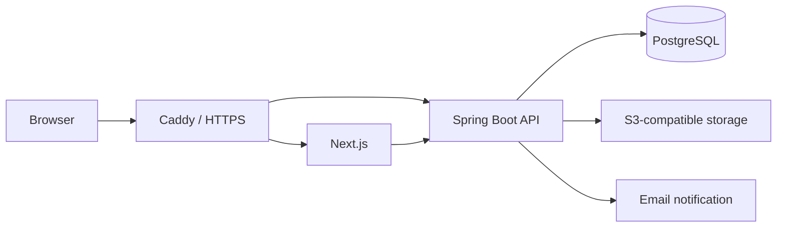

# Denho Photo Company

[日本語](README.md) | [English](README.en.md)

田豊（でんほう）株式会社のために受託開発した、多言語対応のコーポレートサイトおよびコンテンツ管理システムです。

公開サイトでは、事業内容、撮影実績、記事、会社情報、お問い合わせ窓口を日本語・簡体字中国語・英語で提供します。非公開の管理システムからは、担当者がコンテンツ、画像、お知らせ、お問い合わせを一元管理できます。

> **プロジェクト状況：公開準備中**
>
> 主要な設計・実装は完了しており、現在は実際の写真と文言を反映する最終調整を進めています。内容確認後、本番環境へデプロイする予定です。

## プロジェクトの背景

本プロジェクトは、実際の事業で継続利用されることを前提に開発した商用Webアプリケーションです。単なる静的な会社案内ではなく、公開後も社内担当者が安全に情報を更新できる運用基盤を目指しました。

要件整理から情報設計、フロントエンド、API、データベース、認証、テスト、コンテナ構成まで、一貫して設計・実装しています。

## 主な機能

### 公開サイト

- 日本語・簡体字中国語・英語の3言語対応
- サービス、撮影実績、記事、会社情報の閲覧
- 多言語コンテンツとSEOを考慮したルーティング
- レスポンシブデザイン
- お問い合わせフォーム
- 期間を指定できるサイト内お知らせ

### コンテンツ管理

- 管理者・編集者のロールベースアクセス制御
- 記事、撮影実績、お知らせの作成・編集
- 下書き、公開、アーカイブのワークフロー
- コンテンツの変更履歴と監査イベント
- S3互換オブジェクトストレージを利用したメディア管理
- お問い合わせの確認とステータス管理

### セキュリティと運用

- Argon2idによるパスワードハッシュ化
- 8文字以上のパスワードとログイン失敗時の一時ロック
- サーバーサイドセッションと権限検証
- 送信元検証、CSRF、ハニーポット、レート制限によるフォーム保護
- Content Security Policyを含むセキュリティヘッダー
- Flywayによるデータベースマイグレーション
- 暗号化バックアップとリストア検証用ツール

## システム構成



- Next.jsは公開ページと管理画面を提供します。
- Spring Boot APIは認証、コンテンツ、メディア、お問い合わせを管理します。
- PostgreSQLはコンテンツ、セッション、変更履歴、監査情報を保持します。
- OpenAPI定義からTypeScriptのAPI型を生成し、フロントエンドとバックエンドの契約を同期します。
- 本番構成ではCaddyがHTTPS終端とリバースプロキシを担当します。

## 技術スタック

| 分野 | 技術 |
| --- | --- |
| Frontend | Next.js 16, React 19, TypeScript, Tailwind CSS 4 |
| Forms | React Hook Form, Zod |
| Backend | Java 25, Spring Boot 4.1, Spring Security, Spring Data JPA |
| Database | PostgreSQL, Flyway, JDBC Session |
| Storage / Email | S3-compatible Object Storage, Amazon SES |
| API Contract | OpenAPI 3, openapi-fetch |
| Testing | Vitest, Testing Library, Playwright, JUnit, Testcontainers |
| Infrastructure | Docker Compose, Caddy |

## ディレクトリ構成

```text
apps/
├── web/        # 公開サイトおよび管理画面
└── api/        # Spring Boot API
infra/          # ローカルサービス、本番コンテナ、バックアップ関連
```

## ローカル開発

### 必要環境

- Node.js 24 LTS
- npm
- Java 25
- Docker

### セットアップ

依存関係をインストールします。

```bash
npm ci --ignore-scripts
```

`infra/.env.example`、`apps/web/.env.example`、`apps/api/.env.example` をもとに、それぞれ `infra/.env`、`apps/web/.env.local`、`apps/api/.env` を作成します。データベースとオブジェクトストレージの接続値は、`infra/.env` と `apps/api/.env` で一致させてください。

その後、PostgreSQL、ローカルオブジェクトストレージ、メール確認用サービスを起動します。

```bash
docker compose --env-file infra/.env -f infra/compose.yml up -d
```

別のターミナルでAPIを起動します。Spring Bootは `apps/api/.env` を自動では読み込まないため、先に環境変数として取り込みます。

macOS / Linux：

```bash
set -a
. apps/api/.env
set +a
cd apps/api
./gradlew bootRun
```

Windows PowerShell：

```powershell
Get-Content .\apps\api\.env | Where-Object { $_ -match '^\s*[^#][^=]*=' } | ForEach-Object {
  $name, $value = $_ -split '=', 2
  Set-Item -Path "Env:$($name.Trim())" -Value $value.Trim()
}
.\apps\api\gradlew.bat -p .\apps\api bootRun
```

3つ目のターミナルでWebアプリケーションを起動します。`npm run dev` はWebだけを起動するため、ローカルサービスとAPIを先に起動しておく必要があります。

```bash
npm run dev
```

開発サーバーは `http://localhost:3000` で確認できます。

## 検証

フロントエンド：

```bash
npm run test:unit
npm run lint
npx tsc --noEmit -p apps/web/tsconfig.json
npm run build
```

バックエンド：

```bash
cd apps/api
./gradlew build
```

ローカルサービスの起動後、ブラウザE2Eテストも実行できます。

```bash
npm run test:e2e --workspace @tianho/web
```

## 公開について

このリポジトリはポートフォリオおよびコードレビューを目的として公開しています。実際の認証情報、顧客データ、非公開の運用手順は含まれていません。

本番用の写真、文章、商標など、田豊株式会社または第三者から提供される素材の権利は、それぞれの権利者に帰属します。

## ライセンス

ソースコードは閲覧目的で公開していますが、オープンソースではありません。無断での利用、複製、改変、再配布、販売、またはデプロイを禁止します。詳細は [LICENSE](LICENSE) を参照してください。
